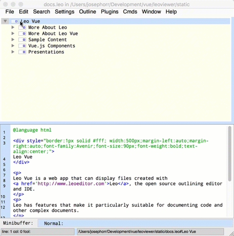

[](https://vuejs.org/)
[](https://david-dm.org/kaleguy/leovue)

<div class="lv-md">

# LeoVue

Use the Open Source [Leo Outlining Editor](http://leoeditor.com) to create tree-based websites.

Content items can be text, markdown, or html with Vue components.

Tree nodes can load content from websites or files, including other .leo files.

## [Live Site with Docs](https://kaleguy.github.io/leovue/)


## Leo
Leo is a cross platform desktop program that allows you to create outlined content,
like the docs.leo file from this project shown below:




## LeoVue
You can use LeoVue to view Leo files with a browser. LeoVue also allows you to put urls in node titles,
with the content pane showing the url content.


## Outline Formats
LeoVue allows you to view outlines in various formats, including inline.


## Vue Components in Content
Content in nodes can contain Vue components or csv data. LeoVue renders the Vue components.


## Create Nested Presentations
LeoVue uses the Reveal.js library to create presentations from Leo outlines. As with any Leo content, content can be nested and content items can be cloned (shared in multiple presentations).


## Menu items and Linked Scroll
Each menu item can point to a single content item, or you can combine menu items into scrolling pages.


## Summary Nodes

LeoVue has a couple of directives that create summary nodes: nodes that summarize content found in other nodes.

Two types of summary nodes are currently implemented in LeoVue. You can add your own summary directive by customizing the code in one of these directives.


### Kanban

Some people find Leo outlines to be a good way to organize to-do lists and projects.

However, if you have your projects in Leo, you still might want to be able to display a level of your project list as a Kanban board, so that others can easily see that section's progress.

Using the @kanban directive, you can create a kanban board from a node. The next level node become the columns of the boards, and the lower levels are displayed via the nested accordion component.


### Mermaid Flowchart

[Mermaidjs](https://mermaidjs.github.io/) is a markup language for creating and viewing diagrams such as flowcharts and Gannt charts. If your index.html page has a link to the Mermaid CDN, you can use this markup in LeoVue to create and display Mermaid diagrams.

The @mermaid directive will create a flowchart from the nodes under the directive node. Because of Leo's clone nodes, these flowcharts can be more complex than simple trees.

The node in the mermaid directive can have options for sizing the chart and adding styles and icons to the nodes. Node titles can use standard Mermaid syntax such as |line text|{node text}. Clicking on a diagram node pops up the node text or optionally navigates to the node in LeoVue.

For more information, see the
**[LeoVue Docs](https://kaleguy.github.io/leovue/)**.

[](https://youtu.be/vjJUkYGBIw0 "Mermaid diagrams with LeoVue")


## More Examples

[Plays of William Shakespeare](https://kaleguy.github.io/leovue/examples/shakespeare/)

[Plays of William Shakespeare, version with nested menus and no header](https://kaleguy.github.io/leovue/examples/shakespeare_n/)

[More](https://kaleguy.github.io/leo-examples/)


## Quick Start

LeoVue requires a webserver to run. Either install it on your server or run it locally with http-server:

``` bash
# install node.js, then:
npm install -g http-server

```

For a quick start using LeoVue from a CDN, see [this example repo](https://kaleguy.github.io/leo-examples/)

[LeoVue CDN](https://www.jsdelivr.com/package/npm/leo-vue)


## Build Setup

``` bash
# install dependencies
npm install
# serve with hot reload at localhost:8080
npm run dev
# build for production with minification
npm run build
# build for production and view the bundle analyzer report
npm run build --report

```

## Static Site Builder

This project includes a utility to generate a static site. The outline tree becomes a standalone page, as do each of the content items. These are simple HTML pages with no javascript, so Vue components in content don't work.
This feature is for generating a site that is easily crawlable, for example for SEO. The pages are very basic at the moment because they aren't really intended for viewing, but styles could be added to make them more presentable.

To generate the static site:

```
# build site with static pages for SEO, files will be generated into dist/static/site

npm install xmldmom
npm install xslt4node
npm run build-static

```

## Deploying to Github-Pages

If you set up your Github repo to serve pages from the docs folder (in repo settings), you can use the following script to make a clean distribution into that folder:

```
npm run build-deploy

```

The above command is for deploying this repo. If you simply are trying to get a leo file to display as a web page, you can do that with
a single index.html file, your leo file, and the LeoVue CDN. See [this example repo](https://kaleguy.github.io/leo-examples/).

## Built With

Main feature components:

* [Vue.js](https://vuejs.org/) - The web framework used
* [Vue.D3.Tree](https://github.com/David-Desmaisons/Vue.D3.tree)
* [Highlight.js](https://highlightjs.org/) - Code highlighting

Main Content Components:

* [Vue-Chartjs](https://github.com/apertureless/vue-chartjs) - Charts
* [Bootstrap-Vue](https://bootstrap-vue.js.org/) - Multiple Components
* [Vue-Table-Component](https://github.com/spatie/vue-table-component) - Tables
* [Mermaid](https://mermaidjs.github.io/) - Diagrams
* [MathJax](https://www.mathjax.org/) - Math Notation
* [Reveal.js](https://revealjs.com/#/) - presentations
* [Vue2-Leaflet](https://github.com/KoRiGaN/Vue2Leaflet) - maps
* [Bootstrap-Vue](https://bootstrap-vue.js.org/)

Libraries
* [Defiant.js][https://defiantjs.com]
* [Lunr](https://lunrjs.com/) and [Vue-Instant](https://github.com/santiblanko/vue-instant) - Search
* [Velocity-Animate](https://www.npmjs.com/package/velocity-animate) - Animation

## Running Offline

The following components are accessed via CDN, so if you want to run offline you'll need to download them and change the links in the relevant files (e.g. index.html).

* MathJax
* Revealjs
* Mermaid

## Run with Docker

```
docker build -t leovue .
docker run -p 8080:8080 leovue
```

## Versioning

We use [SemVer](http://semver.org/) for versioning.
For the versions available, see the [tags on this repository](https://github.com/kaleguy/leovue/tags).

## Authors

* **kaleguy**

## More Vue development info

For detailed explanation on how Vue works with this project, check out the [guide](http://vuejs-templates.github.io/webpack/) and [docs for vue-loader](http://vuejs.github.io/vue-loader).

## Acknowledgments

Many thanks to **Edward K. Ream** for the uniquely useful Leo program.

Many thanks to **Evan You** and the many contributors to the Vue project and Vue ecosystem.

</div>
