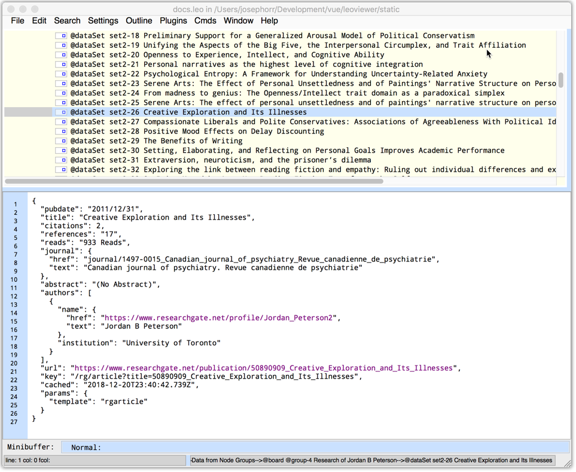
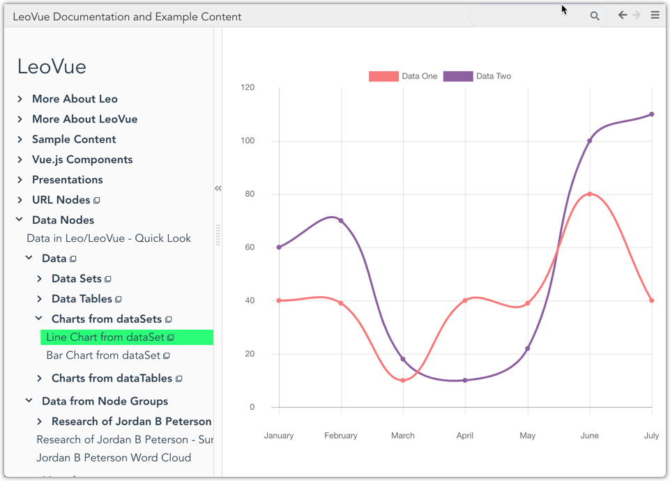
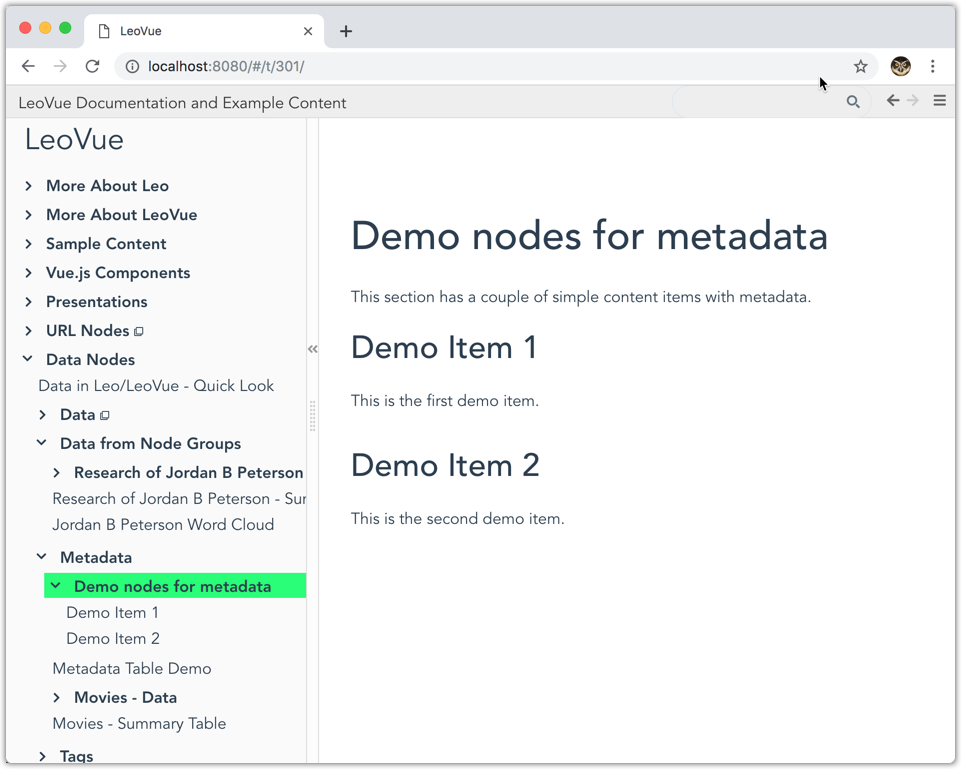
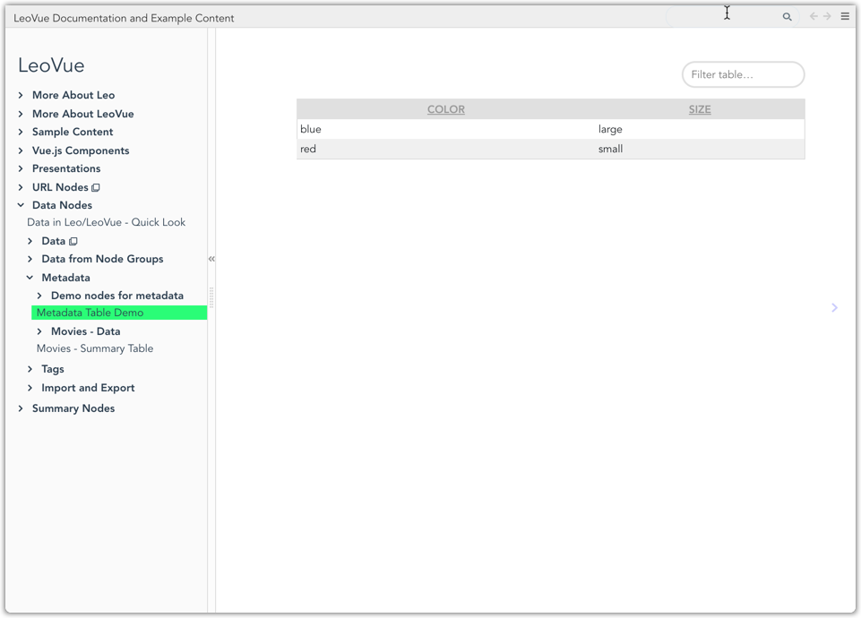
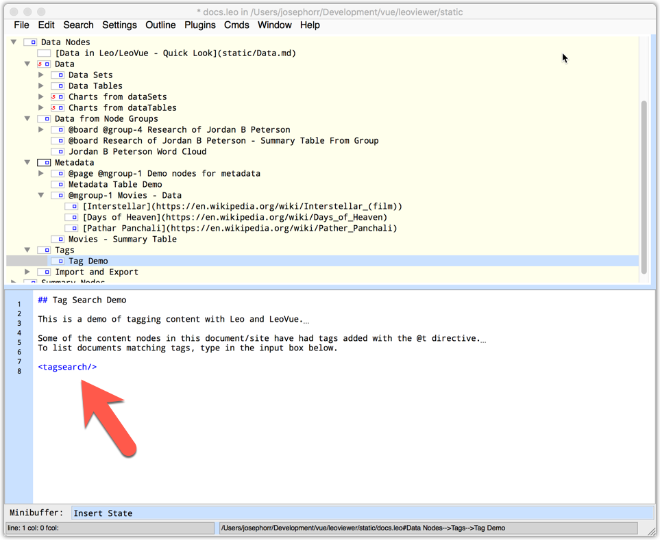
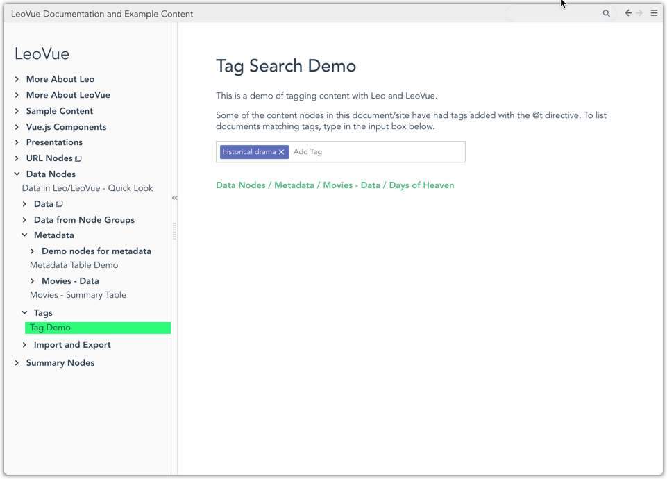

# Data and Metadata in Leo/LeoVue

## Data

When you create an outline to be displayed in LeoVue, node content can 
be JSON data. 

For example, here is some JSON data in a Leo Node. Note that there 
is a 'template' property.

When viewed in LeoVue, the data from the node is displayed with 
the corresponding template. (Templates are lodash templates, and can 
be put in your index.html file. See the LeoVue repo for examples.)

You can give data nodes names with the @dataset directive:

In another node, you can then add a Vue.js component that 
uses the dataset:

LeoVue renders the Vue.js component:

If you have a set of data nodes, as in the screenshot below, you can add then @group directive:

The @group directive creates an array of JSON data. You can use the summary-table component:

to display a tabular summary:

## Metadata

Regular content nodes can also have metadata (in YAML) using the 
@m directive:

LeoVue does not display the @metadata:

However, behind the scenes Leo attaches the metadata to the node 
object. You access the metadata by creating a metadata group 
with the @mgroup directive:

The @mgroup directive creates an array of metadata items that 
can be used just like any other JSON data:

displays in LeoVue as:

## Tags

The @t directive is similar to the @m directive, except that 
instead of JSON or YAML, what follows the @t directive is a simple 
list of tags:

Tags can be used with the &lt;tagsearch/&gt; directive:

The tagsearch component displayed in LeoVue:

