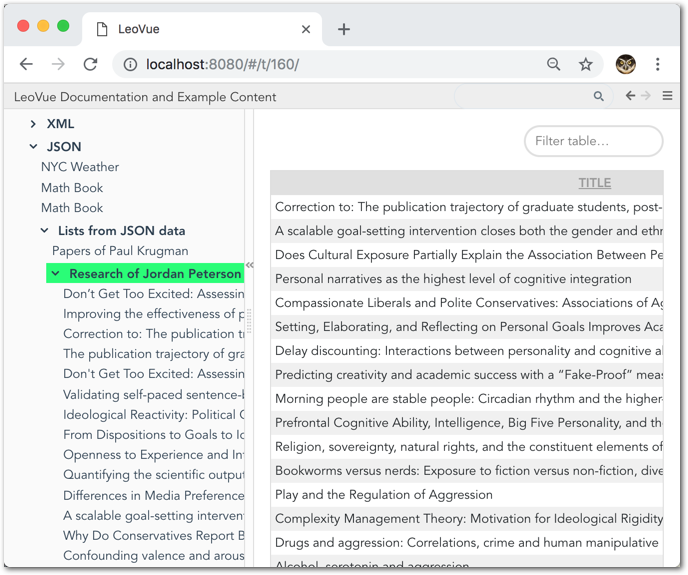
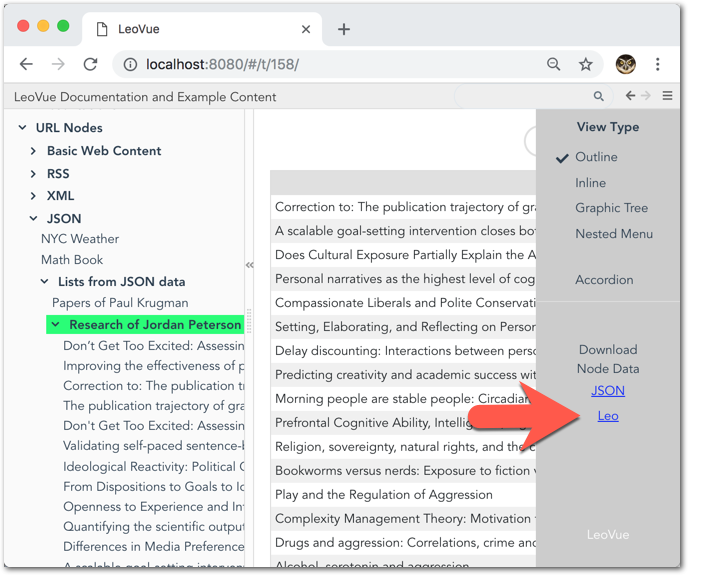
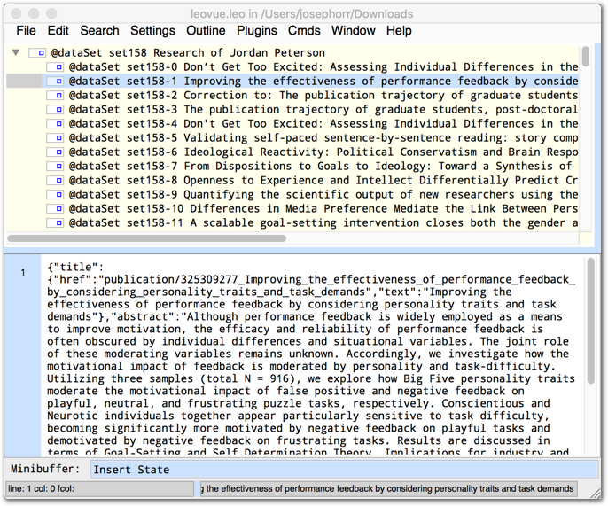
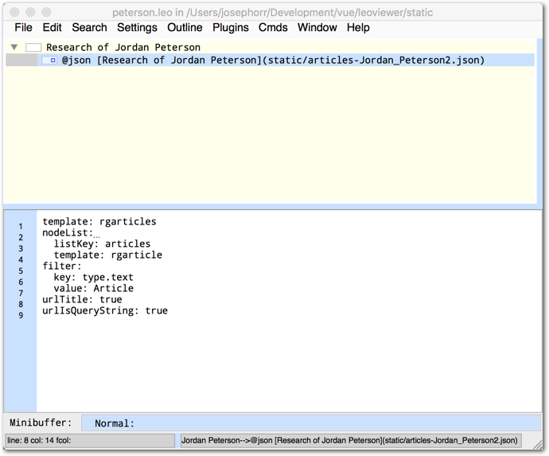
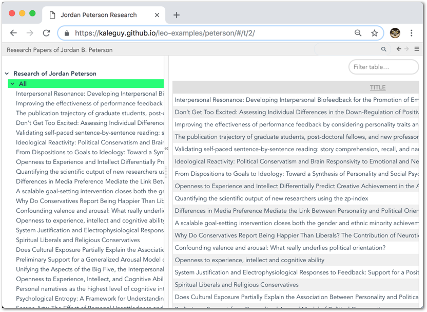
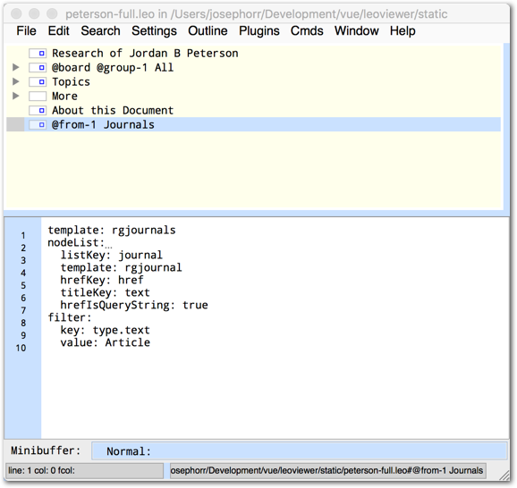
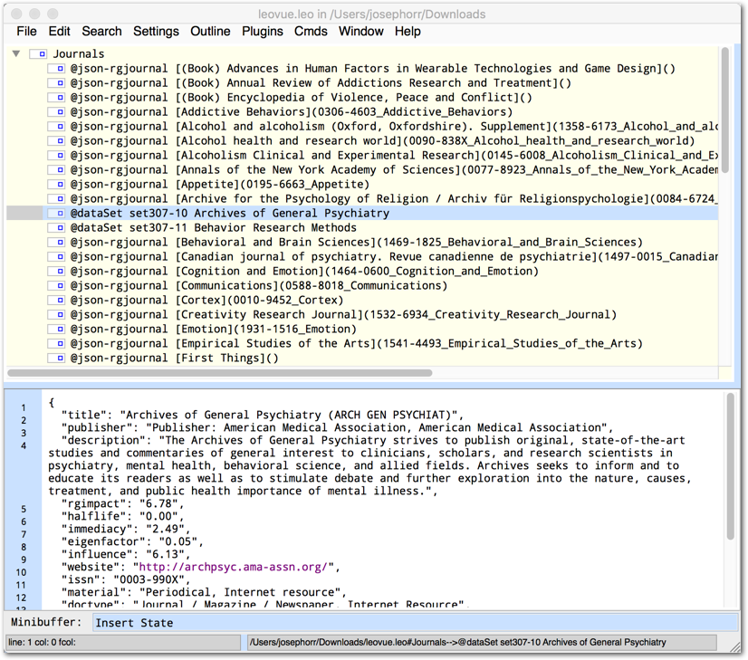

# LeoVue - Leo - LeoVue

1. Use LeoVue to import content into Leo 
2. Edit in Leo
3. Display the edited Leo file in LeoVue

## JSON Nodes

A node with the following format will load JSON from the given url. 

```
@json [Title](url)
```

For example, if you have a Leo file with the following node title:

```
@json [Math Book](https://openlibrary.org/api/books?format=json&jscmd=data&bibkeys=ISBN:0201558025)
```

And in the content of the Leo node, you specify a template and optionally more key-value pairs, for example:

```
template: openbooks
comments: This is a math book. It was on the Openlibrary site.
```

Then, when the file is viewed with LeoVue and the user clicks on the node, the JSON at the above URL will be retrieved by LeoVue and then applied to the 'openbooks' template, with the resulting formatted content displayed in the node content pane.

A note about templates, these are lodash templates and can be placed in your index.html file. The id of the template is the name of the template. For examples, see the index.html file at the LeoVue Github repo.

## Export to Leo Format

As described in the previous section, when you click on a JSON node in LeoVue, LeoVue downloads the JSON at the URL. LeoVue stores this JSON along with the template name and any other values found in the original Leo file. It stores the raw JSON, not the formatted HTML.

If you open the side menu, you can see a link for 'Download Node Data'. This allows you to download the data in the current node. 

If you haven't clicked on any JSON nodes and therefore have not loaded in any JSON data, when you export a node you just get the same data in the original file. 

However, if you have clicked on a JSON node, the file you export will new data in it. In this way you can use LeoVue to load data which is then exported into a Leo file that you can open in Leo for further organization.

## An Example: ResearchGate

The [Scraper-API](https://github.com/kaleguy/scraper-api) project can be used to extract JSON data from ResearchGate, a site for scientific research papers.

You can extract JSON for a single article or for a list of articles.

If the JSON you are retrieving is an array of items, then you can tell LeoVue to create child nodes for these items.

For example if you have a node in your Leo file like this:

```
@json [Research of Jordan Peterson](http://localhost:8888/rg/articles?name=Jordan_Peterson2)
```

Combined with this node content:

```
template: rgarticles
nodeList: 
  listKey: articles
  template: rgarticle-brief
```

The JSON that will be downloaded from the URL above should look something [like this](https://cdn.jsdelivr.net/npm/leo-vue@1.18.1/static/articles-Jordan_Peterson2.json). 

Here's a view of a Leo file with a node like the one above (with a couple of extra params in the content node):


When you click on the node in LeoVue, LeoVue will retrieve the JSON for the given URL, which has an array of articles. It will create a child node for each article like this:



You can select a node and download a Leo file for that node:



If you download the Leo file for the node starting at 'Research of Jordan Peterson' as in this example you will see that the downloaded Leo file has new nodes below the original node:



Note that the child nodes have a @dataSet directive. Directives are hidden in LeoVue, so you don't see this in the title in LeoVue.

Behind the scenes LeoVue has created a new dataSet node for each array item instead of creating a regular content node. This is so that components elsewhere in the Leo file can refer to this dataSet. For an example of this read on...

## More JSON Options

In the example above, a single JSON directive on a node will result in a set of child nodes when displayed with LeoVue. This is because the 'nodeList' parameter has been specified.

```
nodeList: 
  listKey: articles
  template: rgarticle-brief
```

* **listKey**: the key in the JSON data that is pointing to the array of items
* **template**: The template to use to display an item

In this case, LeoVue will construct a set of child nodes from the JSON data array, and each node will get as content a single item from the data array.

You can also tell LeoVue not to create datasets with node content but to instead create more JSON nodes. For example, in the following Leo file:



You can see in the node content there are some new parameters:

```
nodeList: 
  listKey: articles
  template: rgarticle
  titleKey: title.text
  hrefKey: title.href
  hrefIsQueryString: true
```

* **titleKey**: the key for the title of a single item
* **hrefKey**: The key for the url of a single item
* **hrefIsQueryString**: use the href as a query string - append it to the url listed for the template in the page configuration (lconfig object in index.html)

If you view this in LeoVue and then download the Leo file from LeoVue, you end up with a different result than above:


Now the child nodes are not dataSets, rather they are new JSON nodes. This is because the 'hrefKey' param has been specified.

You can see that the node content is the same as for the previous example. This is because LeoVue still fills in the node content from the original array. 

However, if you load this new file into LeoVue and click on one of these nodes, the node content will get replaced with new JSON downloaded from the URL specified in the node title.

In this case, the original array of articles has limited information about each article. When you create a set of JSON nodes, the URL of a node points to a different endpoint with a richer data set for an individual article.

Here is a screenshot of the Leo file you get if you click on all of the links, downloading the corresponding JSON and converting the node to a dataSet. (This screenshot shows a Leo file where the nodes have been regrouped into a parent called 'All').


There is a Vue component called 'summary-table' in the body of the parent node:

```
<summary-table
 :cols="[{show: 'title', label: 'Title'},{show: 'pubdate', label: 'Date'}, {show: 'journal.text', label: 'Journal'}, {show: 'citations', label: 'Citations', dataType:'numeric'}]" >  
</summary-table>
```

The Summary Table component creates a sortable table from the combined JSON items in the child nodes.


You can also use the @board directive to make the Summary Table take up the full content area.

The final file in LeoVue:


<br>
[Research of Jordan B Peterson](https://kaleguy.github.io/leo-examples/peterson/#/t/1) 

The benefit of using LeoVue to download data into Leo for further processing is that you can then organize your content in multiple ways.

Leo's clone nodes have the benefits of both folders (hierarchical groups) and tags (more than one path to a content item). When you are done organizing your content with Leo, you can then view the newly edited Leo file with LeoVue. You can also use Summary Table and other Vue components (e.g. charts) to present different aspects of your content sets.

## JSON extracted from node groups

Using the @from and @group directives, you can take an array of JSON nodes and create a new set of JSON nodes. An example of this follows:

### The @group directive

First, we'll give a node a @group-1 directive. 

This allows us, among other things, to refer to this group the same way we can refer to a single dataSets in the Chartjs components:

```
<bar-chart 
  group=1 
  :sparse="true" 
  period=year 
  :board="true"
  legendLabel="Number of Articles"
  :backgroundColor="'#8e5ea2'"
  dataKey=pubdate />
```

Note that instead of the dataSet property, a group has been specified. The group data will be the data set for this bar chart.


### The @from directive

Now that we have grouped the articles to get arrays of JSON data, we can use the @from directive to create new lists extracted from the original group.

In the JSON in the example above, there is a journal object that looks like this:

```
  "journal": {
    "href": "journal/1180-4882_Journal_of_psychiatry_neuroscience_JPN",
    "text": "Journal of psychiatry &neuroscience: JPN"
  },
```

Now we would like to make a list of Journals. We can extract this list of journal objects from the JSON group we just made. We make a node with the following title:

```
@from-1 Journals
```

And with the following node content:

```
template: rgjournals
nodeList: 
  listKey: journal
  template: rgjournal
  hrefKey: href
  titleKey: text
  hrefIsQueryString: true
```

The node title has a "@from-1" directive, so data will be selected from the "1" group. The key ("listKey") of the object to be extracted from each member of the group 1 data set is "journal", so we will get those.



In LeoVue, the above node will create a set of child nodes from the author keys, like this:


We have specified an hrefKey, so each node created by LeoVue will be a @json link node. We can see this if we download (export) the Leo file for the author node from LeoVue and then open in Leo:



Note that two of the nodes are dataSet nodes. That is because in this example, before downloading the Leo file from the author node, we first clicked on the first two nodes. This caused the link node to execute, fetching the data at the link, and then replacing the node with a dataSet node containing that data.


