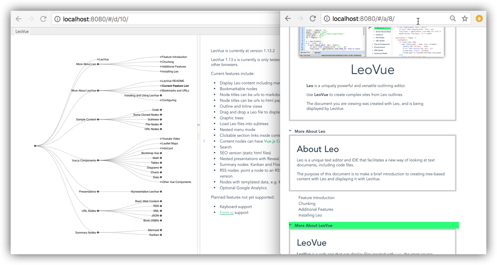
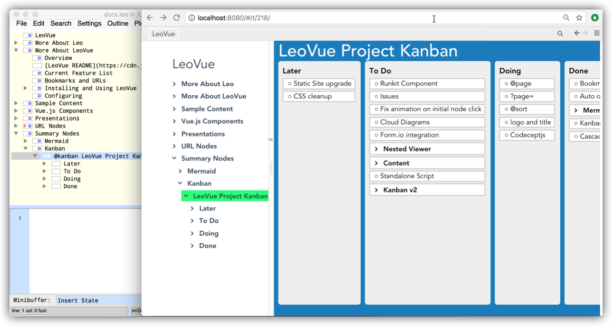

### Knowledge Organization with Leo And LeoVue

* Create outlines, add content or point to content.
* Create outlines of outlines

**Example, the Plays Of William Shakespeare**
* First Leo file: all plays of William Shakespeare, with multiple categorizations.
* Second Leo file, a single outlined play
* LeoVue: Browse all plays and read

### Multiple Tree Styles

From option menu on upper right, pick a tree/menu style.

### Create Content in Text, HTML or Markdown

LeoVue supports plain text, HTML or Markdown. Either add content
to your Leo outline, or point to external files (for example, a README.md file).

### Load External Files from your Leo Outline

If a Leo outline node title is a markdown link, LeoVue will load
the (formated) content into the node. Leo will also load the content
from any compatible URL (for example, wikipedia).

### Add Vue Components to your Content

Put Vue Components in your content. Bootstrap-Vue, Chartjs and other
components included by default, or add your own.

### Vue-Chartjs charts from outline or URL Data

You can put JSON or CSV data in one Leo node and display the data as a chart in
another node. Or, load data from a JSON feed.

### Create Nested Presentations from Leo Outlines

The @presentation directive converts a Leo subtree into a Revealjs presentation.

LeoVue presentations can be multilevel, just like Leo outlines. Any supported LeoVue content is
supported, so you can add Markdown, HTML or Vue Components to your presentations.

### Create Diagrams from Outlines

You can convert a Leo subtree to a Mermaidjs diagram. To see
the Mermaidjs source code, click on the source icon in the upper
right.

### Display an Outline as a Kanban board.

A Leo outline can be used for simple task management. Display a
Leo outline (or portion of an outline) as a Kanban.

### Display RSS, XML or JSON content.

1. In Leo, use the @JSON directive to create a link to a JSON source.
1. Specify the template to use for the JSON
1. LeoVue displays the JSON formatted with your template.

### IDE - Leo - LeoVue

1. Import a file into Leo and organize it with an outline.
1. Edit the original file in your IDE
1. Reload in Leo and save, the outline is updated with your content changes.
1. Put your Leo file online with LeoVue.

### Leo + Markdown + LeoVue = Wiki

Put internal links in content to Leo nodes. Leo nodes can point to external files, including
markdown files. Local markdown files are preloaded so that they are searchable. Publish with LeoVue.

### And More...

See the online documentation for detailed working examples, or fork the repo to
create your own versions. To see how this document was created, view the source file
**docs.leo** use the Leo program.

